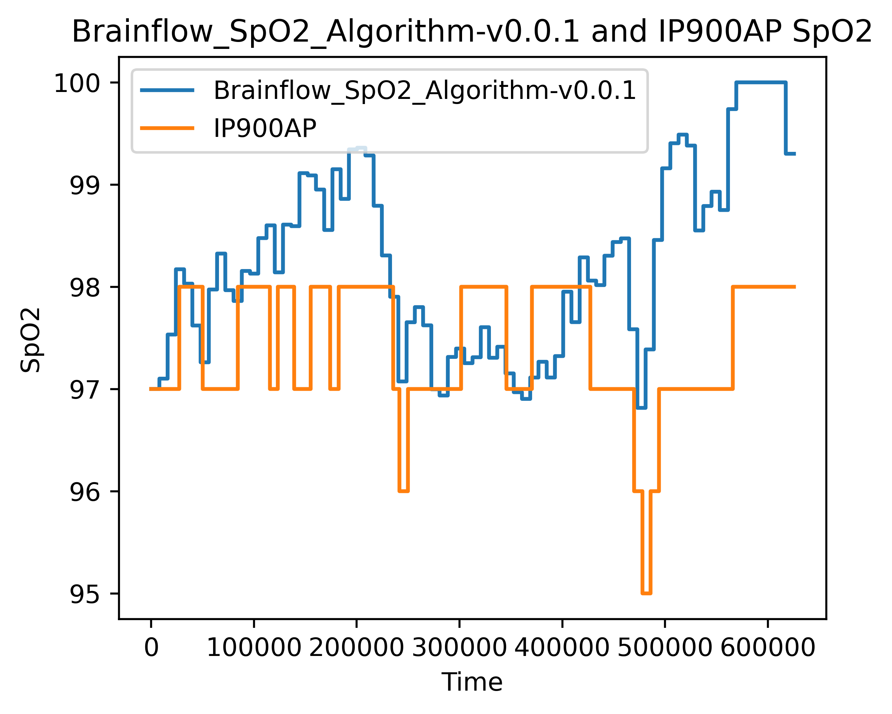
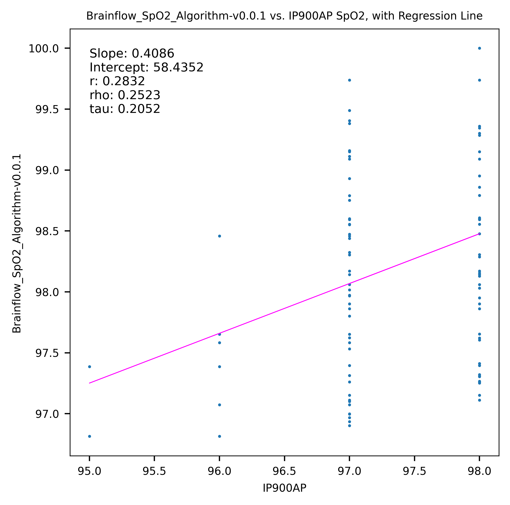
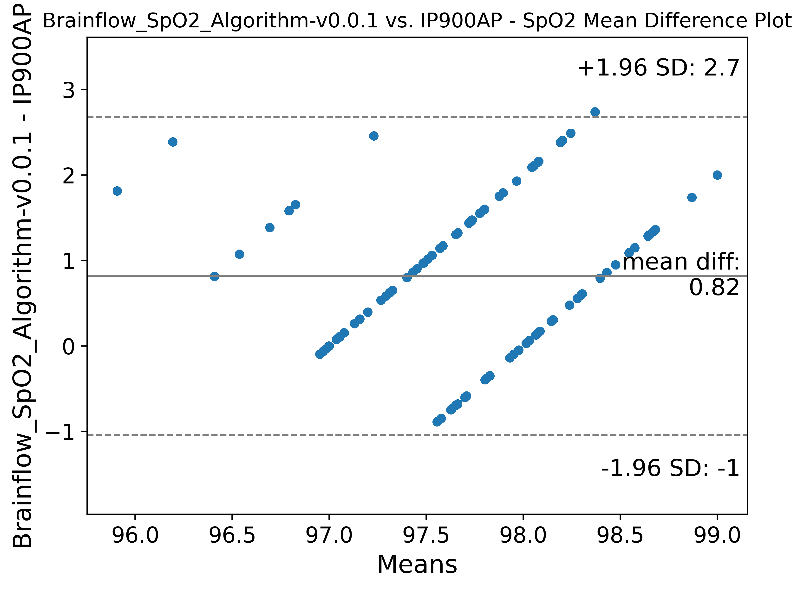
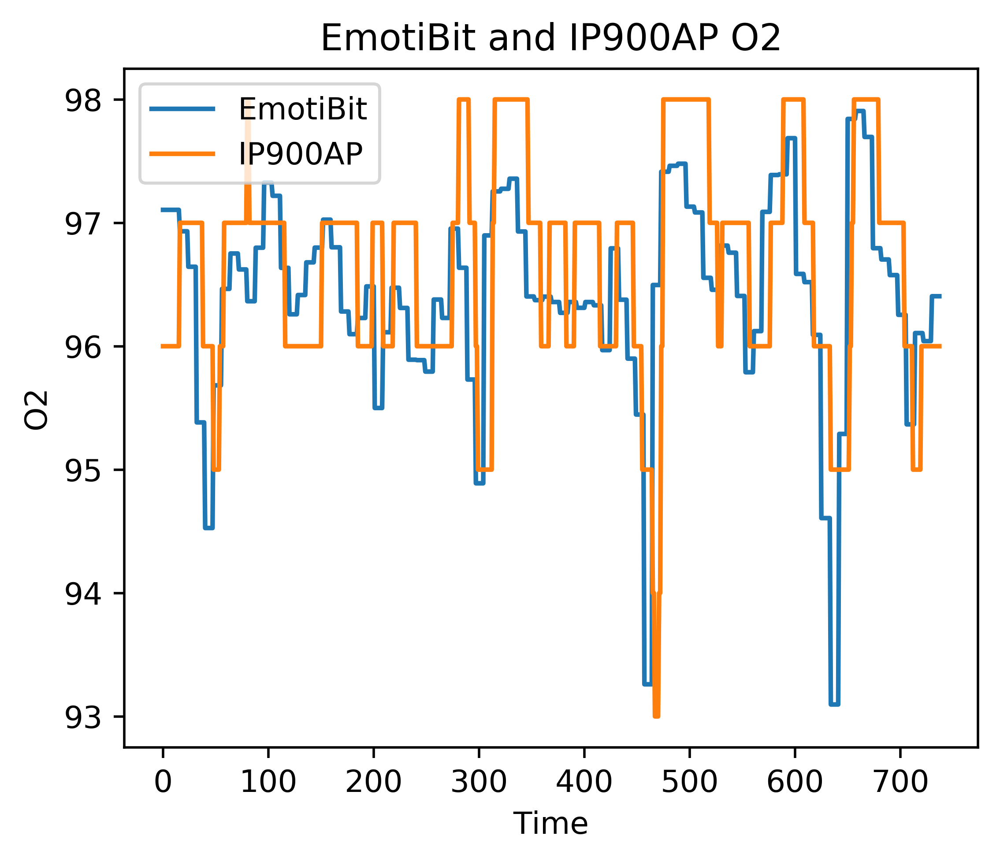
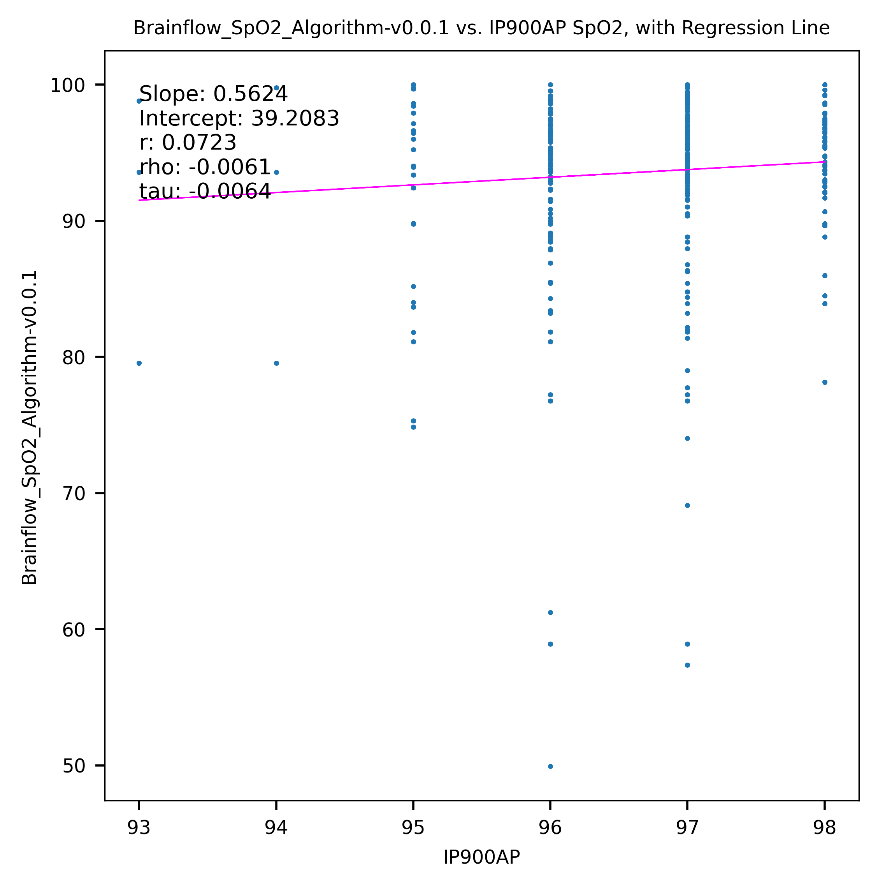
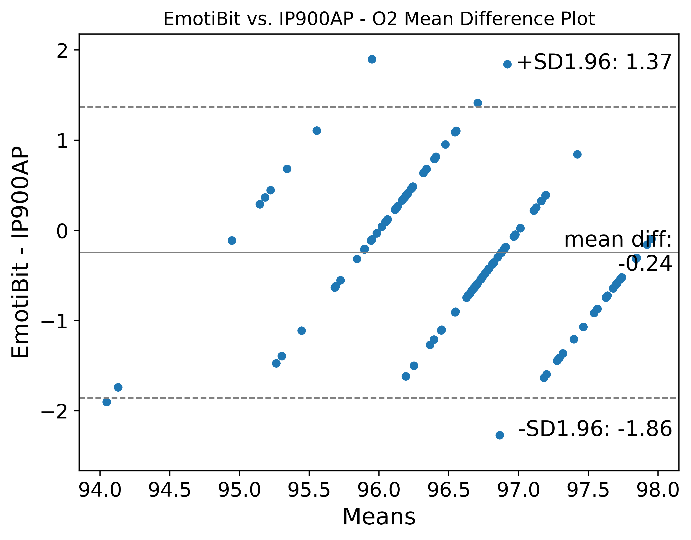

# Description
This algorithm is derived from the Brainflow SpO2 algorithm and uses PPG-R and PPG-IR data from the EmotiBit to calculate SPO2 level. 
The repository has been setup to enable using the spO2 source code in both Arduino and a standalone python script. We did this to enable testing source in pyhton, to fast track testing and enable us to improve algorithm performance with a shorter loop.

- Arduino: To use this library in Arduino, just clone the git repo or download it using the Arduino Library manager into your `Arduino/libraries` directory.
- Python:
  - We use pybind11 to create bindings for the c++ source. The resulting `pyd` file is then used by the Python script.
  - To learn more about using pybind and python, check out the [pybind/README.md](./pybind/README.md).

# Scripts
## `run.py <path_to_data_folder>`
Runs the Brainflow algorithm on the provided data folder (which needs to contain a separate .csv file for PPG-R and PPG-IR from the EmotiBit ending in `PR.csv` and `PI.csv`) and saves the calculated SpO2 with timestamps to `calculated_spo2.csv`. Also shows a plot of the PPG data overlayed with the calculated SpO2.

# Performance
Plots were created using `scorer.py` from the [EmotiBit Biometric Lib repo](https://github.com/EmotiBit/EmotiBit_Biometric_Lib/blob/a82244efcccb6512258c802b8eebd2d1895d8990/py/examples/scorer_example/scorer_example.py#L1)
## [sit-stand-sit_v0.0.0](https://github.com/EmotiBit/Biometric_Validation_Methods/releases/tag/sit-stand-sit_v0.0.0)
Device | Custom Dataset? | Resample Test | Scatterplot | Mean-Difference Plot
--- | --- | --- | --- | ---
[IP900AP](https://www.amazon.com/Innovo-Fingertip-Oximeter-Plethysmograph-Perfusion/dp/B07YVGZPRZ?th=1) | No |  |  | 
## [simulated-unobstructed-airway_v0.0.0](https://github.com/EmotiBit/Biometric_Validation_Methods/releases/tag/simulated-unobstructed-airway_v0.0.0)
Device | Custom Dataset? | Resample Test | Scatterplot | Mean-Difference Plot
--- | --- | --- | --- | ---
[IP900AP](https://www.amazon.com/Innovo-Fingertip-Oximeter-Plethysmograph-Perfusion/dp/B07YVGZPRZ?th=1) | No |  |  | 
